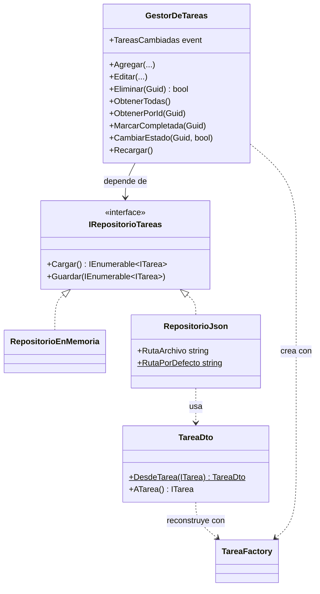

# Punto 3: Persistencia de datos y CRUD del GestorDeTareas

**Responsable:** Victor (rama `feature/victor`)
**Proyecto:** Sistema de Gestión de Tareas con Componentes Modulares (Desarrollo y Reutilización de Software)

Este documento explica qué se hizo en el punto 3, cómo se encontró el repositorio al empezar, qué decisiones se tomaron y cómo deben usar este trabajo los puntos 4 y 5 (UI).

---

## 1. Entorno de desarrollo recomendado

Se decidió **instalar las herramientas de .NET directamente en Windows** en lugar de usar un contenedor Docker, por tres razones:

1. **La interfaz es WinForms** (`net10.0-windows`, `UseWindowsForms`). WinForms solo funciona en Windows: no corre en un contenedor de Linux, y los contenedores de Windows no tienen pantalla, así que no se podrían ver ni probar las ventanas.
2. **El proyecto apunta a .NET 10**, así que solo hace falta el SDK de .NET 10.
3. **La solución usa el formato `.slnx`**, que necesita el SDK de .NET 10 o Visual Studio 2026.

Opciones:

| Opción | Ventaja |
|---|---|
| **Visual Studio 2026 Community** con la carga de trabajo "Desarrollo de escritorio de .NET" | Trae el diseñador visual de formularios (recomendado para los puntos 4 y 5) |
| **SDK de .NET 10** + VS Code con la extensión C# Dev Kit | Más ligero; suficiente para la lógica Core |

Instalar el SDK desde la terminal:

```bash
winget install Microsoft.DotNet.SDK.10
```

Compilar la solución:

```bash
dotnet build SistemaGestionTareas.slnx
```

---

## 2. Se copiaron desde el repositorio


### Solución aplicada

Se recuperaron los archivos desde `develop` hacia `feature/victor`:

```bash
git checkout origin/develop -- GestionTareas.Core
```

Commit: `365217e` *Restaurar modelos, TareaFactory y FiltradoDeTareas desde develop*.

> ⚠️ **Pendiente para el equipo:** `origin/master` sigue sin el código (está en el commit del revert). Quien haga el punto 7 (Git/QA) debería revisar el estado de `master` antes de integrar.

---

## 3. Revisión del trabajo de los puntos 1 y 2

### Punto 1: Modelos y TareaFactory ✅
- `ITarea`, la clase abstracta `TareaBase` y tres tareas concretas: `TareaSimple`, `TareaConFecha` y `TareaPrioritaria`.
- Enumeraciones `TipoTarea` y `NivelPrioridad`.
- `TareaFactory.CrearTarea(...)` aplica el **patrón Fábrica** con un `switch` sobre el tipo y valida que el título no esté vacío.

### Punto 2: FiltradoDeTareas ✅
- Métodos de extensión con LINQ que se pueden encadenar: `PorEstado`, `PorRangoDeFechas`, `PorTipo`, `ContieneTexto` y `PorPrioridad`.
- Cumple el requisito de **filtrar por fecha o completitud**.
- Detalles menores de estilo (no afectan): mezcla dos estilos de `namespace` y tiene `using` que sobran.

### Puntos que afectaban la persistencia
1. **`Id` y `FechaCreacion` tienen `protected set`.** Al leer un JSON, `System.Text.Json` no podría asignarlos y generaría un `Guid` nuevo cada vez. Las tareas cambiarían de Id al reabrir la aplicación, y editar o eliminar por Id fallaría.
2. **Guardar una lista de `ITarea` (una interfaz)** no conserva el tipo concreto de cada tarea (Simple, ConFecha o Prioritaria).

La solución elegida se explica en la siguiente sección.

---

## 4. Diseño de la solución (punto 3)

### Estructura de archivos

```
GestionTareas.Core/
├── Models/
│   └── TareaBase.cs            (modificado: método internal RestaurarIdentidad)
├── Services/
│   └── GestorDeTareas.cs       (nuevo)
└── Storage/
    ├── IRepositorioTareas.cs   (nuevo)
    ├── RepositorioEnMemoria.cs (nuevo)
    ├── RepositorioJson.cs      (nuevo)
    └── TareaDto.cs             (nuevo)
```

### Diagrama de clases (simplificado)



### Decisiones tomadas

| Decisión | Motivo |
|---|---|
| **Interfaz `IRepositorioTareas`** (patrón Repositorio / Estrategia) | El `GestorDeTareas` no sabe si guarda en memoria o en archivo. Se elige el modo al construirlo, sin cambiar nada más. Cumple el requisito "almacenar en memoria o en un archivo". |
| **Inyección por constructor** en `GestorDeTareas` | Desacopla el gestor del almacenamiento y permite probarlo fácilmente con `RepositorioEnMemoria`. |
| **`TareaDto`** para serializar | Las clases del modelo no tienen constructores ni setters aptos para JSON. Un objeto plano evita modificar el modelo y guarda el `Tipo` para saber qué tarea reconstruir. |
| **Reconstrucción con `TareaFactory`** | Al cargar el JSON se reutiliza la fábrica del punto 1 en lugar de duplicar la lógica de creación. Es un ejemplo directo de **reutilización de componentes**. |
| **`RestaurarIdentidad` como `internal`** en `TareaBase` | Es el único cambio al código del punto 1. Permite conservar `Id` y `FechaCreacion` al cargar. Al ser `internal`, solo lo usa el proyecto Core; la interfaz pública no cambia. |
| **Guardado automático** en cada operación | Toda operación que modifica datos llama a `Guardar` en el repositorio. La UI no necesita un botón "Guardar". |
| **Escritura en archivo temporal y luego reemplazo** | Si la aplicación falla mientras escribe, el archivo original no queda dañado. |
| **Enums guardados como texto** (`JsonStringEnumConverter`) | El JSON es más legible (`"Prioritaria"` en lugar de `2`). |
| **Evento `TareasCambiadas`** | La UI puede refrescar el `DataGridView` automáticamente después de cada cambio. |

---

## 5. Componentes en detalle

### `IRepositorioTareas`
```csharp
IEnumerable<ITarea> Cargar();
void Guardar(IEnumerable<ITarea> tareas);
```

### `RepositorioEnMemoria`
Guarda las tareas en una lista interna. Los datos se pierden al cerrar la aplicación. Sirve para pruebas o para usar el sistema sin archivo.

### `RepositorioJson`
- Constructor: `new RepositorioJson(string? rutaArchivo = null)`.
- Si no se indica una ruta, usa `RepositorioJson.RutaPorDefecto`: `%LOCALAPPDATA%\GestionTareas\tareas.json`.
- Si el archivo **no existe** o está vacío → devuelve una lista vacía.
- Si el archivo está **dañado** → lanza `InvalidDataException` con un mensaje claro.
- Crea la carpeta automáticamente si no existe.

### `GestorDeTareas`

| Método | Descripción |
|---|---|
| `ObtenerTodas()` | Lista de solo lectura con todas las tareas |
| `ObtenerPorId(Guid id)` | Devuelve la tarea o `null` |
| `Total` | Cantidad de tareas |
| `Agregar(tipo, titulo, descripcion, fecha?, prioridad)` | Crea la tarea con `TareaFactory` y la agrega |
| `Agregar(ITarea tarea)` | Agrega una tarea ya creada (por ejemplo, desde `FormTareaModal`) |
| `Editar(id, titulo, descripcion, fecha?, prioridad?)` | Modifica una tarea existente. El tipo no cambia |
| `Eliminar(Guid id)` | Devuelve `true` si la eliminó y `false` si no existía |
| `MarcarCompletada(Guid id)` | Marca la tarea como completada |
| `CambiarEstado(Guid id, bool completada)` | Marca la tarea como completada o pendiente |
| `Recargar()` | Vuelve a leer las tareas desde el repositorio |
| `TareasCambiadas` (evento) | Se dispara después de cada cambio |

**Reglas de validación en `Editar`:**
- El título no puede estar vacío → `ArgumentException`.
- Una tarea `ConFecha` requiere fecha de vencimiento → `ArgumentException`.
- Una tarea `Simple` siempre queda sin fecha de vencimiento.
- La prioridad solo se aplica a tareas `Prioritaria`. Si se pasa `null`, se conserva la actual.
- Si el Id no existe → `KeyNotFoundException` (también en `MarcarCompletada` y `CambiarEstado`).
- `Agregar` con un Id repetido → `InvalidOperationException`.

---

## 6. Formato del archivo JSON

```json
[
  {
    "Id": "3725886f-7ac7-4387-a2e8-4a44d015d40c",
    "Tipo": "ConFecha",
    "Titulo": "Entregar proyecto",
    "Descripcion": "Documento final",
    "Completada": false,
    "FechaCreacion": "2026-10-08T20:07:52.8059025-06:00",
    "FechaVencimiento": "2026-10-25T00:00:00",
    "Prioridad": null
  },
  {
    "Id": "681990f6-91a7-4cb6-a656-96ed6d338eca",
    "Tipo": "Prioritaria",
    "Titulo": "Examen",
    "Descripcion": "Estudiar capítulo 3",
    "Completada": false,
    "FechaCreacion": "2026-10-08T20:07:52.8082363-06:00",
    "FechaVencimiento": "2026-10-15T00:00:00",
    "Prioridad": "Alta"
  }
]
```

---

## 7. Uso desde la UI (puntos 4 y 5)

### FormPrincipal (punto 4)
```csharp
using GestionTareas.Core.Models;
using GestionTareas.Core.Services;
using GestionTareas.Core.Storage;

// Elegir el almacenamiento: archivo JSON o memoria
var gestor = new GestorDeTareas(new RepositorioJson());
// var gestor = new GestorDeTareas(new RepositorioEnMemoria());

// Refrescar la tabla cada vez que cambien las tareas
gestor.TareasCambiadas += (_, _) => RefrescarGrid();

void RefrescarGrid()
{
    // Se combina con FiltradoDeTareas (punto 2)
    dataGridView.DataSource = gestor.ObtenerTodas()
        .PorEstado(false)
        .ToList();
}

// Eliminar la tarea seleccionada
gestor.Eliminar(idSeleccionado);

// Marcar como completada
gestor.MarcarCompletada(idSeleccionado);
```

> Nota: `ObtenerTodas()` devuelve una lista de solo lectura. Para el `DataGridView`, conviene usar `.ToList()` como en el ejemplo.

### FormTareaModal (punto 5)
```csharp
// Crear
gestor.Agregar(TipoTarea.Prioritaria, txtTitulo.Text, txtDescripcion.Text,
               dtpFecha.Value, NivelPrioridad.Alta);

// O, si el modal crea la tarea con la fábrica:
var tarea = TareaFactory.CrearTarea(tipo, titulo, descripcion, fecha, prioridad);
gestor.Agregar(tarea);

// Editar
gestor.Editar(tarea.Id, txtTitulo.Text, txtDescripcion.Text, dtpFecha.Value, prioridad);
```

Se recomienda envolver estas llamadas en `try/catch` (`ArgumentException`, `KeyNotFoundException`, `InvalidDataException`) para mostrar el error con `MessageBox`.

---

## 8. Verificación realizada

- `dotnet build SistemaGestionTareas.slnx` → **compilación correcta, 0 advertencias, 0 errores**.
- Se ejecutaron **15 pruebas** con una aplicación de consola temporal (fuera del repositorio). **Todas pasaron:**

| # | Prueba | Resultado |
|---|---|---|
| 1 | Agregar 3 tareas (una de cada tipo) y crear el archivo JSON | ✅ |
| 2 | Eliminar un Id inexistente devuelve `false` | ✅ |
| 3 | Recargar desde el JSON devuelve las 3 tareas | ✅ |
| 4 | Se conservan el Id, el tipo `Simple` y el estado completada | ✅ |
| 5 | La edición (título y fecha) queda guardada | ✅ |
| 6 | El cambio de prioridad queda guardado | ✅ |
| 7 | Se conserva `FechaCreacion` | ✅ |
| 8 | Funciona junto con `FiltradoDeTareas` | ✅ |
| 9 | La eliminación queda guardada | ✅ |
| 10 | El evento `TareasCambiadas` se dispara en cada cambio | ✅ |
| 11 | Editar una tarea `ConFecha` sin fecha lanza `ArgumentException` | ✅ |
| 12 | Editar un Id inexistente lanza `KeyNotFoundException` | ✅ |
| 13 | Un JSON dañado lanza `InvalidDataException` | ✅ |
| 14 | `RepositorioEnMemoria` funciona | ✅ |
| 15 | Si el archivo no existe, se empieza con la lista vacía | ✅ |

Estas pruebas pueden servir de base para la matriz de pruebas funcionales del punto 7.

---

## 9. Commits en `feature/victor`

| Commit | Descripción |
|---|---|
| `365217e` | Restaurar modelos, TareaFactory y FiltradoDeTareas desde develop |
| `c8a5fb2` | Implementar persistencia JSON/memoria y CRUD de GestorDeTareas |

---

## 10. Pendientes y recomendaciones para el equipo

- [ ] Avisar al responsable del **punto 1** sobre el método `internal RestaurarIdentidad` agregado en `TareaBase`.
- [ ] **Punto 7:** revisar `origin/master`, que sigue sin el código por el revert del PR #3.
- [ ] **Puntos 4 y 5:** consumir `GestorDeTareas` como se muestra en la sección 7.
- [ ] **Punto 6:** este documento y el diagrama de la sección 4 pueden servir para el documento formal (reutilización modular, patrones Fábrica y Repositorio).
